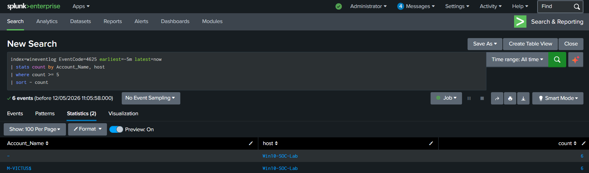
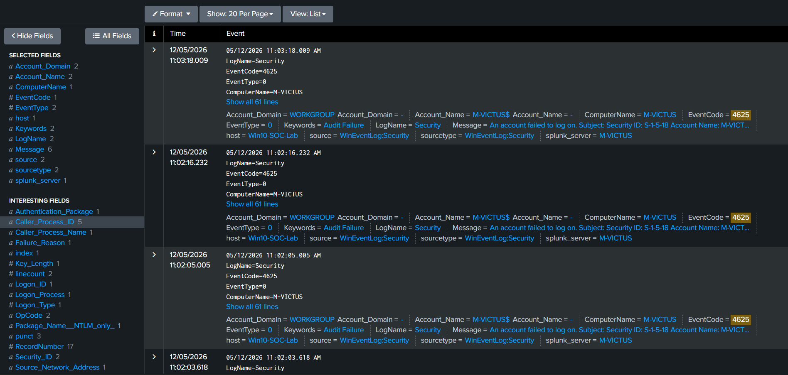
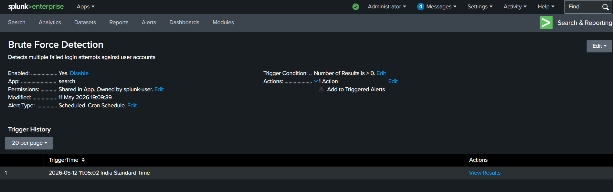
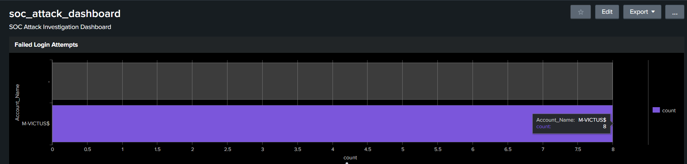

# Brute Force Detection – Splunk Detection Engineering

### Authentication Failure Monitoring using Windows Security Logs

---

## 1. Overview

This detection identifies repeated failed authentication attempts
against Windows user accounts using Windows Security Event Logs.

The detection was developed in Splunk Enterprise using SPL
(Search Processing Language) to simulate real-world SOC
authentication monitoring and brute force attack detection.

The detection provides visibility into:

- Unauthorized login attempts
- Password spraying activity
- Credential guessing attacks
- Account compromise attempts

---

## 2. Detection Logic

The detection monitors Windows failed authentication events
within a short investigation window.

If multiple failed logins are observed against
the same account, the activity is flagged as suspicious.

### Detection Conditions

- Windows Event ID: `4625`
- Threshold: `5 failed logins`
- Time Window: `5 minutes`

---

## 3. Log Source

| Source | Description |
|---|---|
| Windows Security Logs | Authentication activity monitoring |

---

## 4. SPL Detection Query

```spl
index=wineventlog EventCode=4625 earliest=-5m latest=now
| stats count by Account_Name, host
| where count >= 5
| sort - count
```

---

## 5. Investigation Workflow

The investigation process includes:

1. Identify targeted usernames
2. Review failed login frequency
3. Analyze affected systems
4. Correlate with successful logins
5. Investigate suspicious activity patterns

---

## 6. Alert Configuration

| Setting | Value |
|---|---|
| Alert Type | Scheduled |
| Schedule | Every 5 minutes |
| Trigger Condition | Results greater than 0 |
| Throttling | 10 minutes |

---

## 7. MITRE ATT&CK Mapping

| Technique | Tactic | ATT&CK ID |
|---|---|---|
| Brute Force | Credential Access | T1110 |

---

## 8. Detection Validation

The detection was validated by generating
multiple failed login attempts against
a Windows account in the lab environment.

The alert successfully triggered after
the threshold condition was met.

---

## 9. Supporting Evidence

### Brute Force Detection Query





### Failed Login Events





### Triggered Alert





### Dashboard Visualization





---

## 10. Conclusion

This detection demonstrates practical SOC detection engineering
using Splunk Enterprise and Windows authentication telemetry.

The workflow provides visibility into suspicious authentication
behavior and supports early identification of brute force attacks.
