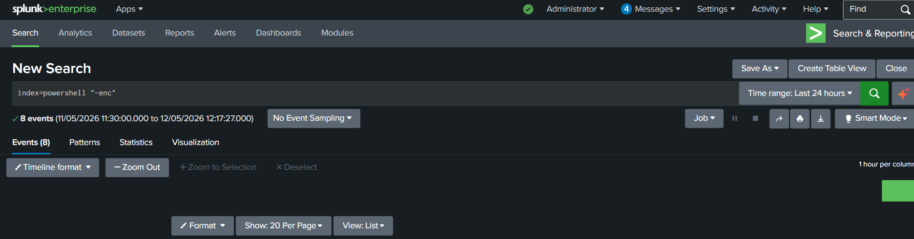

# Suspicious PowerShell Detection – Splunk Detection Engineering

### Encoded PowerShell Monitoring using Windows PowerShell Logs

---

## 1. Overview

This detection identifies suspicious PowerShell execution activity
using Windows PowerShell operational logs.

The detection was developed in Splunk Enterprise using SPL
(Search Processing Language) to monitor potentially malicious
PowerShell command execution.

This detection provides visibility into:

- Encoded PowerShell commands
- Obfuscated script execution
- Malware execution behavior
- Suspicious command-line activity

---

## 2. Detection Logic

The detection monitors PowerShell execution logs
for encoded command usage commonly associated
with attacker tradecraft.

The following indicators are monitored:

- `-enc`
- `-encodedcommand`
- Base64 encoded execution

### Detection Conditions

- PowerShell logging enabled
- Suspicious encoded commands detected

---

## 3. Log Source

| Source | Description |
|---|---|
| Windows PowerShell Logs | PowerShell execution monitoring |

---

## 4. SPL Detection Query

```spl
index=powershell ("*-enc*" OR "*-encodedcommand*")
```

---

## 5. Investigation Workflow

The investigation process includes:

1. Review executed PowerShell commands
2. Identify encoded payloads
3. Analyze command-line behavior
4. Correlate with authentication activity
5. Investigate possible malware execution
6. Review affected systems

---

## 6. Alert Configuration

| Setting | Value |
|---|---|
| Alert Type | Scheduled |
| Schedule | Every 5 minutes |
| Trigger Condition | Results greater than 0 |
| Throttling | 10 minutes |

---

## 7. MITRE ATT&CK Mapping

| Technique | Tactic | ATT&CK ID |
|---|---|---|
| PowerShell | Execution | T1059.001 |
| Command and Scripting Interpreter | Execution | T1059 |

---

## 8. Detection Validation

The detection was validated by executing
an encoded PowerShell command
within the Windows lab environment.

The detection successfully identified
suspicious PowerShell activity.

---

## 9. Supporting Evidence

### PowerShell Detection Query

```markdown

```

### Raw PowerShell Logs

```markdown

```

### Triggered Alert

```markdown

```

### Dashboard Visualization

```markdown

```

---

## 10. Conclusion

This detection demonstrates practical SOC monitoring
for suspicious PowerShell execution activity
using Splunk Enterprise and Windows telemetry.

The workflow improves visibility into
potential malware execution and attacker behavior.