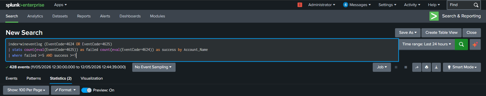
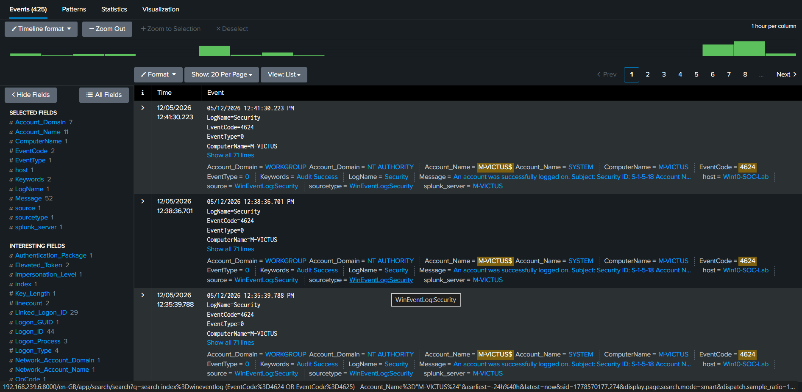
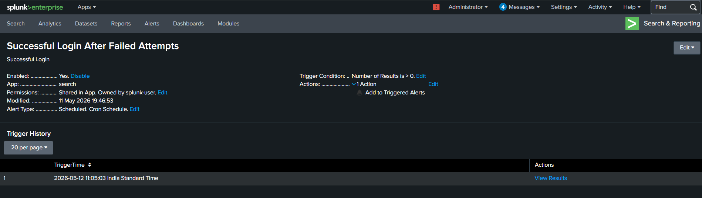
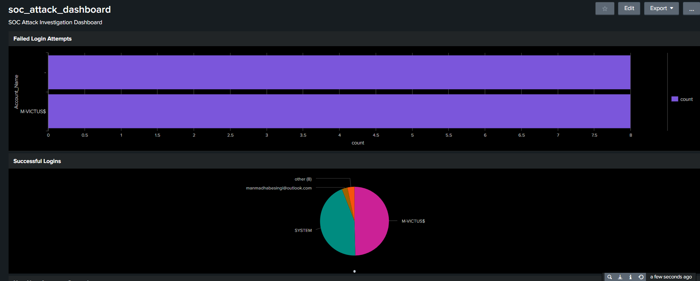

# Login Correlation Alert – Splunk Alert Engineering

### Failed and Successful Authentication Correlation Monitoring

---

## 1. Overview

This alert was created to identify
multiple failed authentication attempts
followed by a successful login
against the same user account.

The alert was developed in Splunk Enterprise
using SPL (Search Processing Language)
and scheduled monitoring.

The alert provides visibility into:

- Successful brute force attacks
- Credential compromise attempts
- Suspicious authentication behavior
- Account takeover activity

---

## 2. Detection Query

```spl
index=wineventlog (EventCode=4624 OR EventCode=4625)
| stats count(eval(EventCode=4625)) as failed count(eval(EventCode=4624)) as success by Account_Name
| where failed >=5 AND success >=1
```

---

## 3. Alert Configuration

| Setting | Value |
|---|---|
| Alert Type | Scheduled |
| Schedule | Every 5 minutes |
| Time Range | Last 5 minutes |
| Trigger Condition | Results greater than 0 |
| Trigger | Once |
| Throttling | 10 minutes |

---

## 4. Alert Workflow

The alert continuously monitors
Windows authentication activity.

If multiple failed logins
are followed by a successful login
for the same account,
the alert triggers automatically.

The workflow enables rapid detection
of suspicious authentication compromise behavior.

---

## 5. Alert Actions

The following alert actions were configured:

- Add to Triggered Alerts
- Display within Splunk monitoring workflow

---

## 6. Investigation Process

After alert generation, the investigation includes:

1. Identify targeted accounts
2. Review failed authentication attempts
3. Verify successful login activity
4. Analyze timestamps and authentication flow
5. Correlate with privilege escalation or PowerShell activity
6. Investigate possible compromise behavior

---

## 7. MITRE ATT&CK Mapping

| Technique | Tactic | ATT&CK ID |
|---|---|---|
| Brute Force | Credential Access | T1110 |
| Valid Accounts | Defense Evasion | T1078 |

---

## 8. Alert Validation

The alert was validated by generating:

- Multiple failed login attempts
- Followed by a successful login

within the Windows lab environment.

The alert successfully triggered
after suspicious authentication behavior occurred.

---

## 9. Supporting Evidence

### Alert Configuration





### Failed and Successful Login Events





### Triggered Alert





### Dashboard Visualization





---

## 10. Conclusion

This alert demonstrates practical SOC alert engineering
for authentication correlation analysis
using Splunk Enterprise and Windows Security telemetry.

The implementation improves visibility into
potential successful brute force compromise activity.
