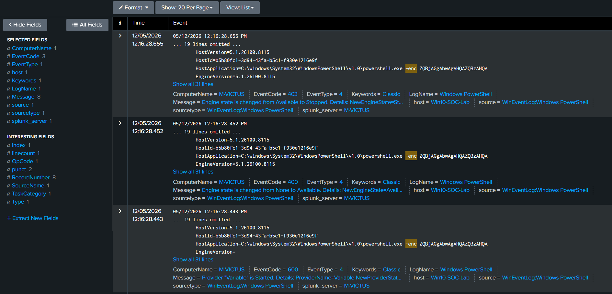
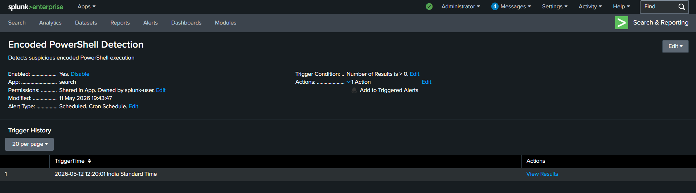
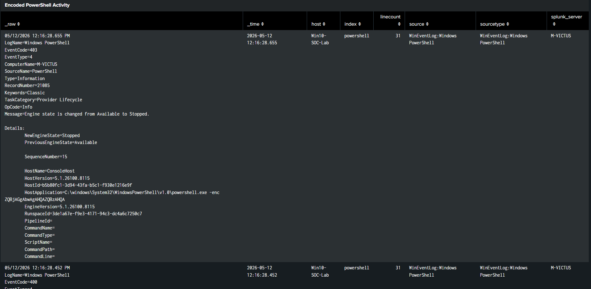

# Suspicious PowerShell Alert – Splunk Alert Engineering

### Encoded PowerShell Monitoring using Windows Logs

---

## 1. Overview

This alert was created to identify suspicious
PowerShell execution activity associated with
encoded or potentially malicious command execution.

The alert was developed in Splunk Enterprise
using SPL (Search Processing Language)
and scheduled monitoring.

The alert provides visibility into:

- Encoded PowerShell commands
- Obfuscated script execution
- Suspicious command-line activity
- Malware execution behavior

---

## 2. Detection Query

```spl
index=powershell ("*-enc*" OR "*-encodedcommand*")
```

---

## 3. Alert Configuration

| Setting | Value |
|---|---|
| Alert Type | Scheduled |
| Schedule | Every 5 minutes |
| Time Range | Last 5 minutes |
| Trigger Condition | Results greater than 0 |
| Trigger | Once |
| Throttling | 10 minutes |

---

## 4. Alert Workflow

The alert continuously monitors
PowerShell execution logs.

If encoded PowerShell commands are detected,
the alert triggers automatically.

The workflow enables rapid identification
of suspicious script execution behavior.

---

## 5. Alert Actions

The following alert actions were configured:

- Add to Triggered Alerts
- Display within Splunk monitoring workflow

---

## 6. Investigation Process

After alert generation, the investigation includes:

1. Review PowerShell command execution
2. Identify encoded payloads
3. Analyze suspicious command activity
4. Correlate with authentication events
5. Investigate malware execution behavior

---

## 7. MITRE ATT&CK Mapping

| Technique | Tactic | ATT&CK ID |
|---|---|---|
| PowerShell | Execution | T1059.001 |
| Command and Scripting Interpreter | Execution | T1059 |

---

## 8. Alert Validation

The alert was validated by executing
encoded PowerShell commands
within the Windows lab environment.

The alert successfully triggered
after suspicious PowerShell activity was detected.

---

## 9. Supporting Evidence

### Alert Configuration





### Triggered Alert





### Dashboard Visualization





---

## 10. Conclusion

This alert demonstrates practical SOC alert engineering
for suspicious PowerShell monitoring
using Splunk Enterprise and Windows telemetry.

The implementation improves visibility into
potential malware execution and attacker behavior.
