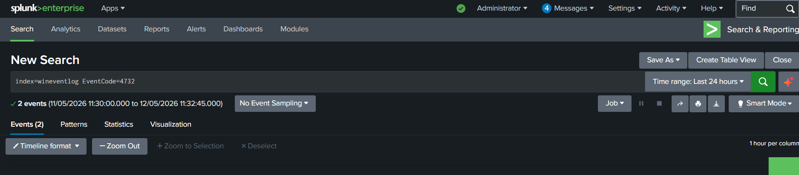
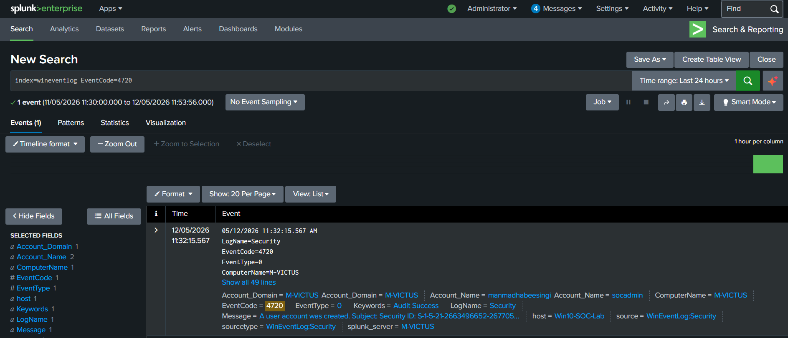
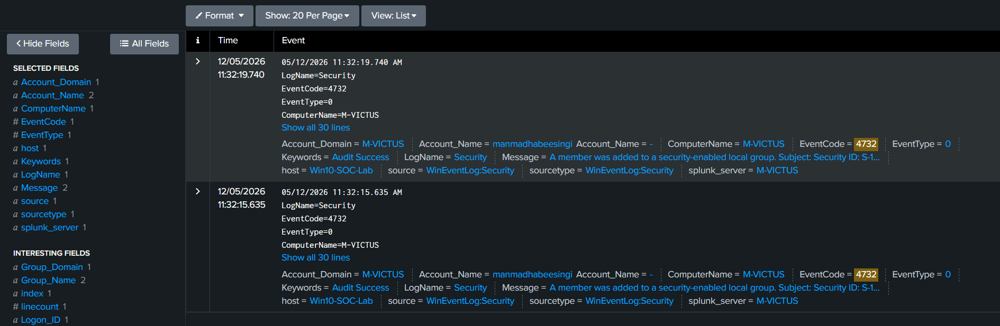
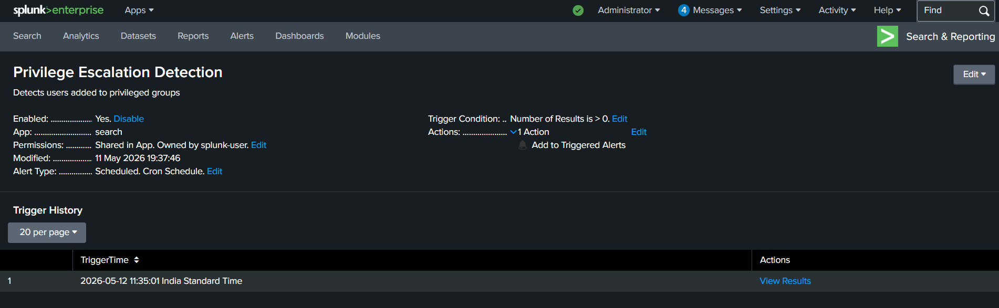
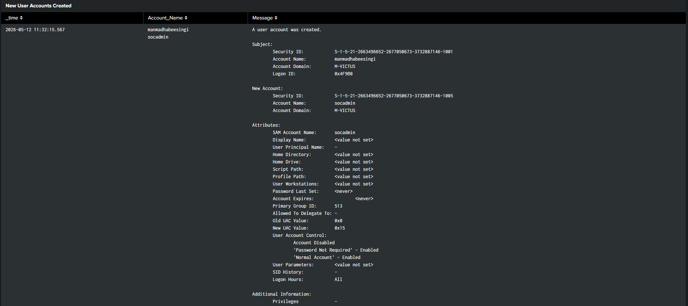
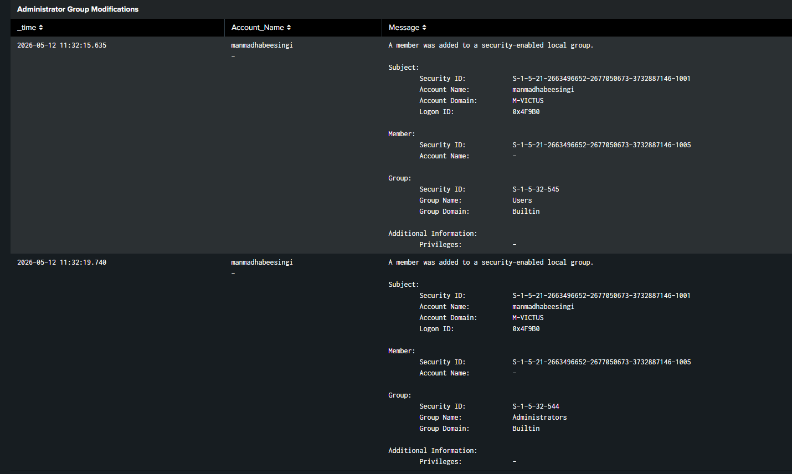

# Privilege Escalation Alert – Splunk Alert Engineering

### Administrative Group Monitoring using Windows Security Logs

---

## 1. Overview

This alert was created to identify
Windows privileged group modification activity
associated with potential privilege escalation behavior.

The alert was developed in Splunk Enterprise
using SPL (Search Processing Language)
and scheduled monitoring.

The alert provides visibility into:

- Administrative privilege escalation
- Unauthorized group modifications
- Suspicious account activity
- Persistence techniques

---

## 2. Detection Query

```spl
index=wineventlog EventCode=4732
```

---

## 3. Alert Configuration

| Setting | Value |
|---|---|
| Alert Type | Scheduled |
| Schedule | Every 5 minutes |
| Time Range | Last 5 minutes |
| Trigger Condition | Results greater than 0 |
| Trigger | Once |
| Throttling | 10 minutes |

---

## 4. Alert Workflow

The alert continuously monitors
Windows privileged group modification events.

If a user is added to a privileged group
such as:

- Administrators
- Backup Operators
- Remote Desktop Users

the alert triggers automatically.

The workflow enables rapid detection
of suspicious privilege escalation activity.

---

## 5. Alert Actions

The following alert actions were configured:

- Add to Triggered Alerts
- Display within Splunk monitoring workflow

---

## 6. Investigation Process

After alert generation, the investigation includes:

1. Identify modified groups
2. Review affected accounts
3. Verify account legitimacy
4. Correlate authentication activity
5. Investigate suspicious persistence behavior

---

## 7. MITRE ATT&CK Mapping

| Technique | Tactic | ATT&CK ID |
|---|---|---|
| Account Manipulation | Persistence | T1098 |
| Valid Accounts | Defense Evasion | T1078 |

---

## 8. Alert Validation

The alert was validated by adding
a user account to the local Administrators group
within the Windows lab environment.

The alert successfully triggered
after the privileged group modification occurred.

---

## 9. Supporting Evidence

### Alert Configuration








### Raw Administrative Group Events





### Triggered Alert




### Dashboard Visualization







---

## 10. Conclusion

This alert demonstrates practical SOC alert engineering
for privileged account monitoring using Splunk Enterprise
and Windows Security telemetry.

The implementation improves visibility into
potential attacker privilege escalation behavior.
