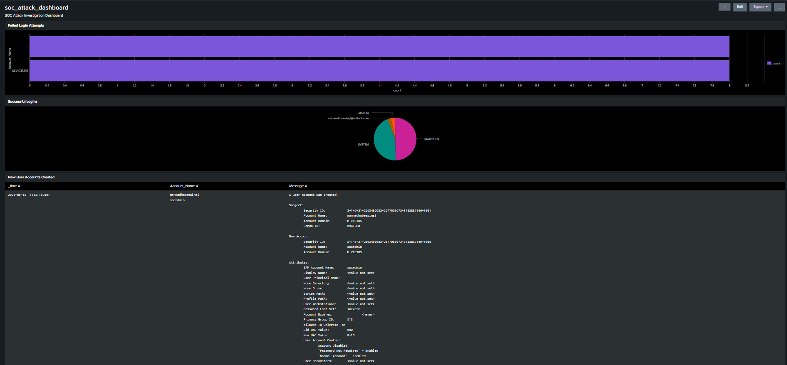
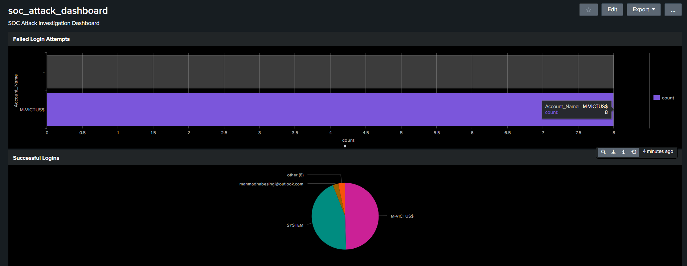
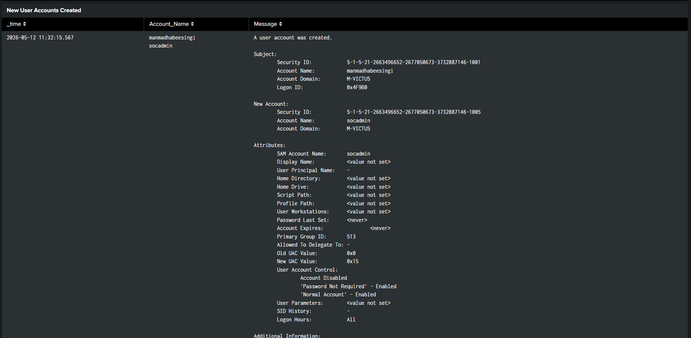

# SOC Monitoring Dashboard – Splunk Visualization Overview

### Centralized Security Monitoring using Splunk Enterprise

---

## 1. Overview

This dashboard was developed in Splunk Enterprise
to provide centralized visibility into security events,
authentication activity, PowerShell execution,
and privilege escalation behavior.

The dashboard supports SOC investigation workflows
by enabling real-time monitoring and rapid detection
of suspicious activity.

The implementation demonstrates:

- Security event visualization
- Authentication monitoring
- Threat detection visibility
- Incident investigation support
- SIEM dashboard engineering

---

## 2. Dashboard Objectives

The dashboard was designed to:

- Centralize security visibility
- Improve detection monitoring
- Support incident investigation
- Visualize attack activity
- Track authentication behavior
- Monitor PowerShell execution

---

## 3. Dashboard Components

The dashboard contains multiple monitoring panels:

| Panel | Purpose |
|---|---|
| Failed Login Monitoring | Detect brute force activity |
| Successful Login Activity | Track authentication behavior |
| Privilege Escalation Monitoring | Detect group modifications |
| PowerShell Activity | Monitor suspicious execution |
| Correlation Monitoring | Identify successful compromise activity |

---

## 4. Data Sources

The dashboard visualizes data collected from:

| Source | Description |
|---|---|
| Windows Security Logs | Authentication and privilege events |
| PowerShell Logs | Script execution monitoring |
| Sysmon Logs | Process and execution telemetry |

---

## 5. Dashboard Workflow

Security events are forwarded from the Windows endpoint
to Splunk Enterprise using Splunk Universal Forwarder.

The dashboard continuously visualizes:

- Authentication activity
- Suspicious PowerShell execution
- Administrative privilege changes
- Correlated attack behavior

This workflow enables rapid SOC investigation
and monitoring capabilities.

---

## 6. Security Monitoring Capabilities

The dashboard supports monitoring for:

- Brute force attacks
- Successful login compromise
- Administrative privilege escalation
- Suspicious PowerShell execution
- Persistence behavior

---

## 7. Detection Integration

The dashboard integrates with multiple detections:

| Detection | Related Event IDs |
|---|---|
| Brute Force Detection | 4625 |
| Successful Login Detection | 4624 |
| Privilege Escalation Detection | 4732 |
| Account Creation Detection | 4720 |
| PowerShell Detection | PowerShell Operational Logs |

---

## 8. Dashboard Validation

The dashboard was validated by generating
real attack telemetry within the lab environment.

The following attack simulations were performed:

- Failed login attempts
- Successful authentication
- User account creation
- Administrative privilege escalation
- Encoded PowerShell execution

All events were successfully visualized
within Splunk dashboard panels.

---

## 9. Supporting Evidence

### Dashboard Overview

```markdown

```

### Authentication Monitoring Panel

```markdown

```

### Privilege Escalation Monitoring

```markdown

```

### PowerShell Monitoring

```markdown

```

---

## 10. Conclusion

This dashboard demonstrates practical SOC visualization
and monitoring engineering using Splunk Enterprise.

The implementation improves security visibility,
supports incident investigation workflows,
and enhances detection monitoring capabilities.