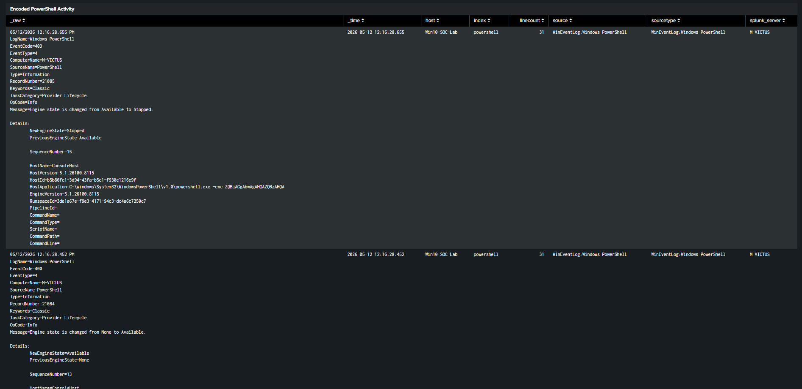
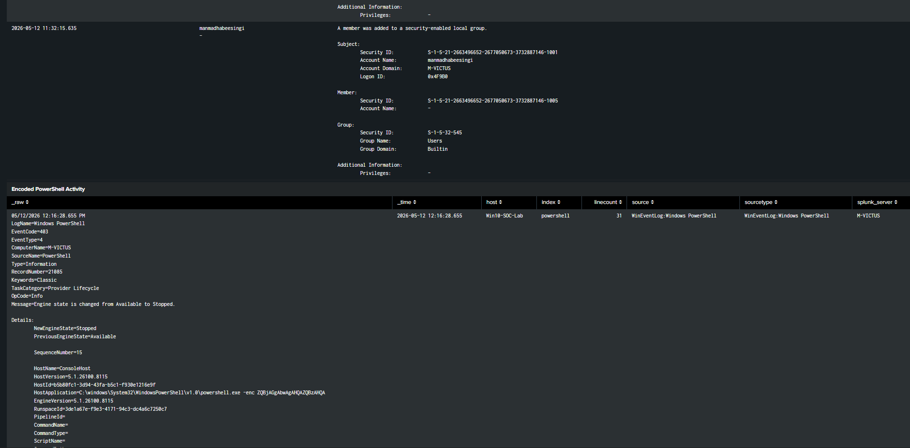
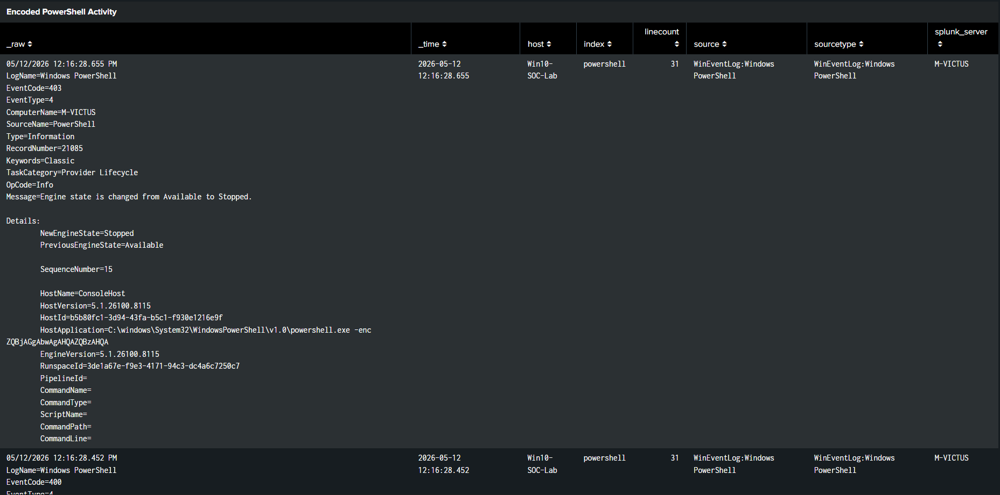

# MITRE ATT&CK Mapping – SOC Attack Investigation

### Detection Engineering and ATT&CK Framework Alignment

---

# 1. Overview

This document maps the simulated attack activity
observed within the SOC lab environment
to the MITRE ATT&CK framework.

The mapping demonstrates how attacker behavior
can be categorized into:

- Tactics
- Techniques
- Adversarial behaviors

This process improves:

- Detection engineering
- Threat visibility
- Incident investigation
- SOC operational maturity

---

# 2. Attack Scenario Summary

The simulated attack chain included:

1. Multiple failed authentication attempts
2. Successful account compromise
3. Privilege escalation
4. Encoded PowerShell execution

The activity generated Windows telemetry
that was analyzed within Splunk Enterprise.

---

# 3. ATT&CK Technique Mapping

| Attack Activity | Tactic | Technique | ATT&CK ID |
|---|---|---|---|
| Failed Login Attempts | Credential Access | Brute Force | T1110 |
| Successful Authentication | Defense Evasion | Valid Accounts | T1078 |
| Privileged Group Modification | Persistence | Account Manipulation | T1098 |
| Encoded PowerShell Execution | Execution | PowerShell | T1059.001 |

---

# 4. Brute Force Detection Mapping

## Attack Behavior

The attacker generated multiple failed login attempts
against a Windows account.

The activity simulated:
- password guessing
- authentication abuse
- brute force behavior

---

## ATT&CK Mapping

| Category | Value |
|---|---|
| Tactic | Credential Access |
| Technique | Brute Force |
| ATT&CK ID | T1110 |

---

## Detection Query

```spl
index=wineventlog EventCode=4625
| stats count by Account_Name
| where count >=5
```

---

# 5. Valid Account Usage Mapping

## Attack Behavior

Following repeated failed authentication attempts,
a successful login was observed.

The activity simulated:
- compromised credentials
- unauthorized account access
- successful authentication abuse

---

## ATT&CK Mapping

| Category | Value |
|---|---|
| Tactic | Defense Evasion |
| Technique | Valid Accounts |
| ATT&CK ID | T1078 |

---

## Detection Query

```spl
index=wineventlog EventCode=4624
```

---

# 6. Privilege Escalation Mapping

## Attack Behavior

A user account was added
to the local Administrators group,
simulating privilege escalation activity.

The activity demonstrated:
- administrative privilege assignment
- persistence behavior
- elevated access acquisition

---

## ATT&CK Mapping

| Category | Value |
|---|---|
| Tactic | Persistence |
| Technique | Account Manipulation |
| ATT&CK ID | T1098 |

---

## Detection Query

```spl
index=wineventlog EventCode=4732
```

---

# 7. PowerShell Execution Mapping

## Attack Behavior

Encoded PowerShell commands were executed
within the Windows environment.

The activity simulated:
- malicious scripting
- obfuscated execution
- attacker command execution

---

## ATT&CK Mapping

| Category | Value |
|---|---|
| Tactic | Execution |
| Technique | PowerShell |
| ATT&CK ID | T1059.001 |

---

## Detection Query

```spl
index=powershell ("*-enc*" OR "*-encodedcommand*")
```

---

# 8. Detection Coverage Summary

| Detection | ATT&CK ID | Status |
|---|---|---|
| Brute Force Detection | T1110 | Implemented |
| Login Correlation Detection | T1078 | Implemented |
| Privilege Escalation Detection | T1098 | Implemented |
| PowerShell Detection | T1059.001 | Implemented |

---

# 9. SOC Investigation Workflow

The MITRE ATT&CK framework supported:

- Attack classification
- Detection engineering
- Investigation prioritization
- Threat behavior analysis
- SOC monitoring workflows

The implementation improved understanding of:
- adversarial behavior
- attack lifecycle mapping
- threat detection strategy

---

# 10. Supporting Evidence

### SOC Dashboard Overview







### Authentication Monitoring Panel


### Privilege Escalation Monitoring


### PowerShell Monitoring





---

# 11. Conclusion

This project demonstrates practical application
of the MITRE ATT&CK framework
within a SOC investigation workflow.

The implementation successfully mapped:
- authentication attacks
- privilege escalation activity
- suspicious PowerShell execution
- attack correlation behavior

using Splunk Enterprise and Windows telemetry.

The project improves:
- detection engineering capability
- threat analysis understanding
- SOC operational visibility
